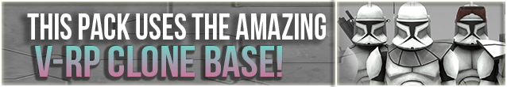

# gmod-vrp-playermodels
## Overview
[](https://steamcommunity.com/sharedfiles/filedetails/?id=2194878789)<br>
This repository contains my edits of the V-RP playermodel base, which is primarily renaming the .smd files<br>
and their associated texture maps for better readability with some minor edits to the meshes of said<br>
.smd files such as seperating the gunner's armour padding into its own seperate bodygroup.

The ```smds\``` folder contains all the renamed bodygroups in addition to the untouched ones alongside<br>
the .qc scripts for easy compilation of desired models.

The root folder contains ```vrp_canvas.obj``` which contains all the bodygroups arranged in a canvas-like<br>
layout to be easily imported into Subsance 3D Painter with the ```textures_pngs\``` folder containing all<br>
the renamed and default base textures in PNG format to unable the setup of a convenient workspace for<br>
painting new designs.

A Substance project file can be found in the repo's releases containing the imported .obj and base textures.

## Bodygroups
<details>

This table lists the renamed bodygroups and their associated textures.<br>

|   Bodygroup                           |   Texture Maps                                                |
|---------------------------------------|---------------------------------------------------------------|
|   arc_backpack.smd                    |   arc_accessories
|   arc_belt_pouches.smd                |   arc_accessories
|   arc_forearms.smd                    |   arc_mag_plating<br>arc_forearm
|   arc_helmet.smd                      |   arc_helmet<br>arc_visor
|   arc_kama_legs.smd                   |   arc_accessories<br>arc_mag_plating<br>kama<br>holsters
|   arc_pauldron_chestplate.smd         |   arc_pauldron<br>arc_chestplate
|   arc_rangefinder_down.smd            |   rangefinder
|   arc_rangefinder_up.smd              |   rangefinder
|   arf_helmet.smd                      |   arf_visor<br>arf_helmet
|   crewman_armour.smd                  |   crewman_shoulders<br>crewman_chestplate
|   crewman_cap.smd                     |   crewman_helmet
|   evo_body.smd                        |   evo_body<br>evo_backpack<br>evo_kama<br>evo_pouches
|   evo_helmet.smd                      |   evo_rangefinder<br>evo_mask<br>evo_visor<br>evo_cap
|   gun_back.smd                        |   dc15a
|   gun_sling.smd                       |   gun_sling
|   kama_holster_left.smd               |   holsters
|   kama_holster_right.smd              |   holsters
|   leg_holster_left.smd                |   holsters
|   leg_holster_right.smd               |   holsters
|   pilot_helmet.smd                    |   trooper_helmet<br>visor<br>pilot_helmet_extension
|   shoulder_antenna.smd                |   shoulder_antenna
|   spec_backpack.smd                   |   snow_body
|   spec_helmet.smd                     |   visor<br>spec_helmet<br>spec_helmet_extension
|   spec_helmet_antenna.smd             |   snow_body
|   trooper_backpack.smd                |   trooper_backpack
|   trooper_binos_down.smd              |   binos
|   trooper_binos_up.smd                |   binos
|   trooper_body_shoulder.smd           |   trooper_body<br>trooper_shoulder<br>undersuit
|   trooper_flashlight.smd              |   flash
|   trooper_helmet.smd                  |   trooper_helmet<br>visor
|   trooper_jetpack.smd                 |   jetpack
|   trooper_kama.smd                    |   kama
|   trooper_pauldron.smd                |   trooper_pauldron
|   trooper_rangefinder_down.smd        |   rangefinder
|   trooper_rangefinder_up.smd          |   rangefinder
|   trooper_sunvisor.smd                |   sunvisor
</details>

## Texture Maps
<details>

This table lists the renamed texture maps and their associated bodygroups.<br>

|   Texture Map                         |   Bodygroups                                                  |
|---------------------------------------|---------------------------------------------------------------|
|   arc_accessories                     |   arc_backpack.smd<br>arc_belt_pouches.smd<br>arc_kama_legs.smd
|   arc_chestplate                      |   arc_pauldron_chestplate.smd
|   arc_forearm                         |   arc_forearms.smd
|   arc_helmet                          |   arc_helmet.smd
|   arc_mag_plating                     |   arc_forearms.smd<br>arc_kama_legs.smd
|   arc_pauldron                        |   arc_pauldron_chestplate.smd
|   arc_visor                           |   arc_helmet.smd
|   arf_helmet                          |   arf_helmet.smd
|   arf_visor                           |   arf_helmet.smd
|   binos                               |   trooper_binos_down.smd<br>trooper_binos_up.smd
|   crewman_helmet                      |   crewman_cap.smd
|   crewman_chestplate                  |   crewman_armour.smd
|   crewman_shoulders                   |   crewman_armour.smd
|   dc15a                               |   gun_back.smd
|   evo_backpack                        |   evo_body.smd
|   evo_body                            |   evo_body.smd
|   evo_cap                             |   evo_helmet.smd
|   evo_kama                            |   evo_body.smd
|   evo_mask                            |   evo_helmet.smd
|   evo_pouches                         |   evo_body.smd
|   evo_rangefinder                     |   evo_helmet.smd
|   evo_visor                           |   evo_helmet.smd
|   flash                               |   trooper_flashlight.smd
|   gun_sling                           |   gun_sling.smd
|   holsters                            |   arc_kama_legs.smd<br>kama_holster_left.smd<br>kama_holster_right.smd<br>leg_holster_left.smd<br>leg_holster_right.smd
|   jetpack                             |   trooper_jetpack.smd
|   kama                                |   arc_kama_legs.smd<br>trooper_kama.smd
|   pilot_helmet_extension              |   pilot_helmet.smd
|   rangefinder                         |   arc_rangefinder_down.smd<br>arc_rangefinder_down.smd<br>trooper_rangefinder_down.smd<br>trooper_rangefinder_up.smd
|   shoulder_antenna                    |   shoulder_antenna.smd
|   snow_body                           |   spec_backpack.smd<br>spec_helmet_antenna.smd
|   spec_helmet                         |   spec_helmet.smd
|   spec_helmet_extension               |   spec_helmet.smd
|   sunvisor                            |   trooper_sunvisor.smd
|   trooper_backpack                    |   trooper_backpack.smd
|   trooper_body                        |   trooper_body_shoulder.smd
|   trooper_helmet                      |   pilot_helmet.smd<br>trooper_helmet.smd
|   trooper_pauldron                    |   trooper_pauldron.smd
|   trooper_shoulder                    |   trooper_body_shoulder.smd
|   undersuit                           |   trooper_body_shoulder.smd
|   visor                               |   pilot_helmet.smd<br>spec_helmet<br>trooper_helmet.smd
</details>